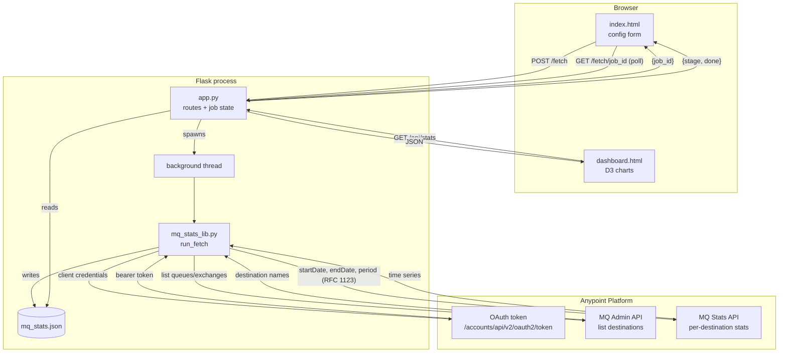

# Anypoint MQ Environment Stats

A small web app that pulls message statistics for every queue (and
optionally exchange) in one Anypoint MQ environment, at a chosen
granularity, and renders them as an interactive dashboard. Built because
MuleSoft's own Anypoint MQ console charts one queue at a time and has no
concept of success, failure or reprocessing. This app rolls up every
destination in an environment and classifies traffic using the raw counters
the Stats API exposes.

## Contents

- `app.py` - Flask web server: the form, the background fetch job, the
  dashboard route, the JSON API
- `mq_stats_lib.py` - the Anypoint MQ client: auth, destination listing,
  per-queue stats fetch, normalization
- `templates/index.html` - the config form and fetch-progress UI
- `templates/dashboard.html` - the D3 dashboard
- `mq_stats.sample.json` - sample data so the dashboard can be tried without
  credentials
- `requirements.txt` - just Flask

## Architecture




Three Anypoint Platform APIs are involved:

1. **Access Management OAuth** (`/accounts/api/v2/oauth2/token`) - exchanges
   a Connected App's client ID/secret for a bearer token
   (`grant_type=client_credentials`).
2. **MQ Admin API** (`/mq/admin/api/v1/.../destinations`) - lists every
   queue and exchange in the environment, so you don't have to name them
   individually.
3. **MQ Stats API** (`/mq/stats/api/v1/.../queues/{id}` and
   `/exchanges/{id}`) - returns historical time series per destination.

The web app is a thin UI and job-management layer around
`mq_stats_lib.run_fetch()`. That function is plain Python with no Flask
dependency, so it is also usable directly from a script or a notebook.


## Known API quirks (and how the code works around them)

| Symptom | Cause | Fix in this code |
|---|---|---|
| `No endpoint GET /api/v1/organizations//environments//regions/.../exchanges` | Blank `ORG_ID`/`ENV_ID` produced a malformed URL | `run_fetch()` validates org/env/region are non-empty before any network call |
| Queue series come back empty (`"series": []`) | The batch `/queues?destinationIds=` endpoint returns a live snapshot, not history, and ignores the date range | `fetch_stats()` calls `/queues/{id}` per destination instead |
| `400 Unable to parse the date "2026-07-13T00:00:00Z"` | Stats API wants RFC 1123, not ISO 8601 | `rfc1123()` formats dates before they're sent; ISO is kept everywhere else |


## Technical considerations

**Rate limiting.** MuleSoft documents a 200 transactions/minute limit on
most Stats API endpoints. `fetch_stats()` sleeps 0.35s between calls,
roughly 170/minute, leaving headroom. An environment with many destinations
will take proportionally longer: ~35 seconds per 100 destinations. There is
no progress cancellation in the UI once a fetch starts; let it finish or
restart the process.

**Retention vs. granularity.** Anypoint MQ stores fewer historical points
at finer granularity. Requesting `15m` buckets over a multi-week window (or
`hour` over many months) will either 400 or return sparse/truncated data.
Defaults are chosen to stay inside typical retention:

| Period | Bucket size | Default window |
|---|---|---|
| `15m` | 15 min | last 24 hours |
| `hour` | 1 hour | last 7 days |
| `daily` | 1 day | last 30 days |
| `weekly` | 7 days | last 12 weeks |

A custom start/end overrides the default; going well beyond these ranges
at a fine granularity is the most likely cause of a 400 from the API.

**Error handling.** HTTP errors raise `FetchError` with the real status
code and response body rather than a generic exception; 429/5xx retry
with backoff; a 404 on a single destination is skipped with a warning
instead of aborting the whole run; validation (blank IDs, unknown period,
missing credentials) happens before any network call. See the project
notes on error handling for the full breakdown, including what is *not*
covered (no job history across restarts, no fetch timeout/cancel, no
re-auth mid-run if a long fetch outlives the token, no auth on the Flask
routes themselves - this is built for local, single-user use).

**Security.** Client secret is submitted via a password-type form field or
read from `ANYPOINT_CLIENT_SECRET`; it is held in memory for the duration
of the request and is not logged or written to `mq_stats.json`. The app has
no authentication of its own and binds to `0.0.0.0` - fine on localhost,
not something to expose on a shared network without putting a reverse
proxy with auth in front of it.

**State.** `mq_stats.json` is overwritten on every successful fetch and
mirrors the in-memory `LATEST` value the dashboard reads from. There is no
history of past fetches; each run replaces the last.

## How to use

### 1. Set up a Connected App in Anypoint Platform

In Access Management → Connected Apps, create an app with **Client
Credentials** grant type and these scopes for the target environment:

- `MQ Stats Viewer` (or equivalent "view stats" permission)
- `MQ Admin` read access (to list destinations)

Note the Client ID and Client Secret.

### 2. Find your IDs

- **Organization ID** and **Environment ID**: Anypoint Platform → Access
  Management → your environment, or visible in the URL when viewing that
  environment.
- **Region**: shown in the Anypoint MQ console when you select a region,
  e.g. `us-east-1`, `eu-west-1`.

### 3. Install and run

```bash
cd mq-webapp
pip install -r requirements.txt
python app.py
```

Open `http://localhost:5000`.

Optionally set credentials as environment variables instead of typing them
into the form each time:

```bash
export ANYPOINT_CLIENT_ID=xxxx
export ANYPOINT_CLIENT_SECRET=xxxx
python app.py
```

### 4. Fetch stats

Fill in Organization ID, Environment ID, Region, and pick a granularity.
Leave the time window blank to use the sensible default for that
granularity, or expand "Custom time window" to set your own. Click **Fetch
stats**. A status line shows live progress (`auth` → `admin` →
`stats` → `done`) and redirects to the dashboard automatically.

To see the dashboard without any credentials, click **Load sample data
instead**.

### 5. Read the dashboard

- **KPI cards** - environment-wide totals: queues tracked, sent, received,
  success, failures, peak backlog.
- **Environment totals chart** - every metric summed across all
  destinations per time bucket. Click the chips to show/hide a metric.
- **Focus queue** - pick any single destination from the dropdown for a
  closer look, with visible backlog on a secondary axis.
- **All destinations** - one mini-chart per queue/exchange, sortable by
  volume, failure count, or name. A red "DLQ" badge marks dead-letter
  queues (by name match on `dlq`).

Hover any chart for exact per-bucket values.

### 6. Re-running

Each fetch overwrites `mq_stats.json`. Re-run the form at any time; the
dashboard re-reads `/api/stats` fresh on every page load, so reloading the
browser after a new fetch shows the latest data.

### Using the fetch logic outside the web app

```python
from mq_stats_lib import run_fetch

doc = run_fetch(
    org_id="...", env_id="...", region="us-east-1",
    period="hour", client_id="...", client_secret="...",
    include_exchanges=False,
    on_progress=lambda stage, detail: print(stage, detail),
)
# doc["queues"], doc["totals"] are ready for pandas, a notebook, etc.
```
